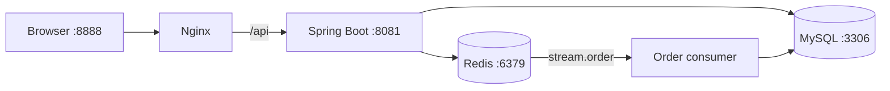

# BiteLog

BiteLog is a local discovery and flash-sale demo built with Spring Boot, MySQL,
Redis, and a Vue-based static frontend. It covers common backend patterns such
as JWT authentication, cache protection, distributed IDs, Lua-based inventory
checks, and asynchronous order persistence with Redis Streams.

The frontend and the project's initial scaffolding are adapted from **Heima
Dianping (黑马点评)**. The backend has been migrated to Spring Boot 3 and Java
21 and includes additional Redis-focused implementations.

## Features

| Area | Status | Details |
| --- | --- | --- |
| Authentication | Implemented | Phone verification-code login/registration and stateless JWT authentication |
| Shops | Implemented | Browse, search, create, and update shops; cache-aside reads with null-value penetration protection |
| Shop categories | Implemented | Redis-backed category list caching |
| Blogs | Partially implemented | Publish, list personal/hot blogs, and increment likes |
| Vouchers | Implemented | Create regular or flash-sale vouchers and list vouchers by shop |
| Flash-sale orders | Implemented | Atomic Redis Lua pre-check, distributed ID generation, Redis Stream queue, and asynchronous database writes |
| Image uploads | Platform-limited | The upload directory is currently hard-coded to a Windows path |
| Follow, comments, logout | Not implemented | Controllers or endpoints exist, but the behavior is unfinished |

## Tech Stack

- Java 21 and Spring Boot 3.4.1
- Spring Web, Spring Data Redis, and Lettuce connection pooling
- MyBatis-Plus 3.5.8 and MySQL
- Redis, Lua scripts, Redis Streams, and Redisson
- Hutool and Lombok
- Nginx 1.18
- Vue 2, Axios, and Element UI (static frontend assets)
- Docker Compose for MySQL, Redis, and Nginx

## Architecture



Nginx serves the frontend and proxies `/api/*` requests to the backend. The
backend uses MySQL for persistent data and Redis for verification codes,
caching, flash-sale stock checks, distributed IDs, and the order stream.

## Repository Layout

```text
.
├── bitelog-backend/                   # Spring Boot application
│   └── src/main/resources/
│       ├── db/bitelog.sql             # Schema and seed data
│       ├── mapper/                    # MyBatis XML mappings
│       └── SeckillVoucher.lua         # Atomic flash-sale validation
├── bitelog-frontend-nginx-1.18.0/
│   ├── conf/nginx.conf                # Static hosting and API proxy
│   └── html/hmdp/                     # Vue frontend
├── docker-compose.yml                 # MySQL, Redis, and Nginx services
└── README.md
```

## Prerequisites

- Java 21
- Maven 3.9 or later
- Docker
- `docker-compose`

The Compose stack exposes ports `3306`, `6379`, and `8888`. Ensure those ports,
plus backend port `8081`, are available before starting the project.

## Configuration

The repository intentionally excludes local secrets. Create both files below
before starting the services. The MySQL and Redis passwords must match between
the two files.

### 1. Docker Compose environment

Create `.env` in the repository root:

```dotenv
MYSQL_PASSWORD=replace-with-a-mysql-password
REDIS_PASSWORD=replace-with-a-redis-password
```

### 2. Backend secrets

Create `bitelog-backend/src/main/resources/application-secret.yml`:

```yaml
spring:
  datasource:
    password: replace-with-a-mysql-password
  data:
    redis:
      password: replace-with-a-redis-password

my-jwt:
  # Use a long, random value in real environments.
  secret: replace-with-a-long-random-jwt-secret
```

Both `.env` and `application-secret.yml` are ignored by Git. Do not commit real
credentials.

## Quick Start

### 1. Start the infrastructure and frontend

From the repository root, run:

```bash
docker-compose up -d
```

This starts:

| Service | Address | Purpose |
| --- | --- | --- |
| Nginx | `http://localhost:8888` | Frontend and `/api` reverse proxy |
| MySQL | `localhost:3306` | Application database |
| Redis | `localhost:6379` | Cache, login codes, stock, and order stream |

The Java backend is **not** included in the Compose stack and must be started
separately.

### 2. Initialize the Redis order stream

Create the stream and consumer group before starting the backend. Replace the
placeholder with the Redis password from `.env`:

```bash
docker-compose exec redis-bitelog redis-cli \
  -a 'replace-with-a-redis-password' \
  XGROUP CREATE stream.order group1 0 MKSTREAM
```

Redis returns `OK` on the first run. A `BUSYGROUP` response means the group
already exists and this step can be skipped.

### 3. Start the backend

In a second terminal:

```bash
cd bitelog-backend
mvn spring-boot:run
```

The API starts on `http://localhost:8081`.

### 4. Open the application

Visit [http://localhost:8888](http://localhost:8888).

The development login flow does not send a real SMS. Enter a valid Chinese
mobile number, request a code, and copy the six-digit code printed in the
backend log into the login form. A new phone number is registered automatically
after successful code verification.

## API Overview

The frontend sends the JWT returned by `POST /user/login` in the
`Authorization` request header. All routes except `POST /user/code` and
`POST /user/login` require a valid JWT.

| Method | Endpoint | Description |
| --- | --- | --- |
| `POST` | `/user/code?phone={phone}` | Generate a verification code and write it to the backend log |
| `POST` | `/user/login` | Log in or register with a phone number and code |
| `GET` | `/user/me` | Return the current user |
| `GET` | `/user/info/{id}` | Return a user's profile details |
| `GET` | `/shop/{id}` | Get a shop by ID through the cache layer |
| `POST` | `/shop` | Create a shop |
| `PUT` | `/shop` | Update a shop and invalidate its cache entry |
| `GET` | `/shop/of/type` | List shops by type with pagination |
| `GET` | `/shop/of/name` | Search shops by name with pagination |
| `GET` | `/shop-type/list` | List shop categories |
| `POST` | `/blog` | Publish a blog post |
| `PUT` | `/blog/like/{id}` | Increment a blog's like count |
| `GET` | `/blog/of/me` | List the current user's blog posts |
| `GET` | `/blog/hot` | List blog posts ordered by likes |
| `POST` | `/voucher` | Create a regular voucher |
| `POST` | `/voucher/seckill` | Create a flash-sale voucher and initialize its Redis stock |
| `GET` | `/voucher/list/{shopId}` | List vouchers for a shop |
| `POST` | `/voucher-order/seckill/{id}` | Place a flash-sale order |
| `POST` | `/upload/blog` | Upload a blog image |
| `GET` | `/upload/blog/delete?name={path}` | Delete a blog image |

Responses use a common envelope:

```json
{
  "success": true,
  "data": {}
}
```

Failures set `success` to `false` and include an `errorMsg` field.

## How Flash-Sale Ordering Works

1. `POST /voucher/seckill` stores the voucher in MySQL and initializes its
   stock in Redis.
2. An authenticated order request executes `SeckillVoucher.lua` atomically.
3. The script rejects sold-out inventory and repeat purchases, decrements Redis
   stock, and appends the accepted order to `stream.order`.
4. A background consumer in the backend reads the stream and writes the order
   and stock change to MySQL.
5. Failed deliveries remain in the Redis pending list and are retried by the
   consumer.

## Useful Commands

Show running services and logs:

```bash
docker-compose ps
docker-compose logs -f
```

Build the backend without running tests:

```bash
cd bitelog-backend
mvn -DskipTests package
```

Stop the Compose services while preserving database and Redis volumes:

```bash
docker-compose down
```

To completely reinitialize the seeded database and Redis state, remove the
volumes as well:

```bash
docker-compose down -v
```

> **Warning:** `docker-compose down -v` permanently deletes the local BiteLog
> database and Redis data.

The SQL initialization script runs only when Docker creates a new, empty MySQL
volume.

## Current Limitations

- `SystemConstants.IMAGE_UPLOAD_DIR` is hard-coded to
  `D:\lesson\nginx-1.18.0\html\hmdp\imgs\`. Image upload and deletion require
  changing that constant when the backend is run outside that Windows layout.
- Logout currently returns `功能未完成`; JWT invalidation is not implemented.
- Follow and blog-comment controllers do not expose working operations.
- Blog likes are simple increments and do not prevent repeated likes.
- Redis Stream consumer-group creation is a manual setup step.
- Nginx is configured with backend upstreams on ports `8081` and `8082`. The
  documented setup starts only port `8081`; Nginx retries the available
  upstream when the other is offline.
- The demo stores passwords without production-grade hashing and should not be
  deployed as an authentication system without additional security work.

## Credits

The frontend assets, seed data, and basic project structure are adapted from
the Heima Dianping educational project. BiteLog is intended for learning and
demonstrating Spring Boot and Redis application patterns.
